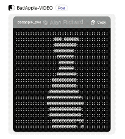
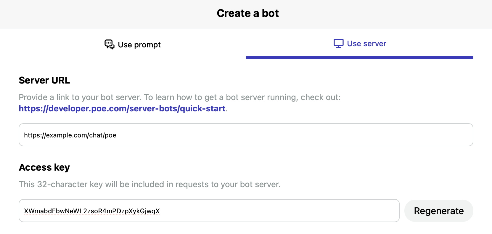

# Poe Bot - Play ASCII Art Video Using Django

This project demonstrates how to build a bot on [Poe](https://poe.com) that streams an ASCII art video with Django.

> Blog post: [Build a Poe Bot That Plays Bad Apple Using Django](https://leaves.one/2023/10/11/poe-bot-play-ascii-video-using-django/)

## Demo

Bad Apple played by [Poe Bot](https://poe.com/BadApple-VIDEO).

## Overview

The bot is built with Django and renders a pre-converted ASCII art video to Poe using server-sent events.

Key features:

- Streams frames over a persistent connection with server-sent events
- Reads ASCII art frames from a text file
- Updates displayed frame using `replace_response` events

## Usage

### Requirements

- Python 3.x
- Django
- sse-starlette
- python-decouple
- opencv-python (for `video2ascii.py`)

### Configuration

1. Install the requirements with `pip install -r requirements.txt`.
2. Convert a video to ASCII frames using `video2ascii.py` (in `tools`) and place the output text file as `resources/video.txt`.
3. Copy the `.env_default` file to `.env` and
   1. Create a server bot on Poe
   2. Set the `POE_ACCESS_KEY` to your Poe bot's access key.
   3. Set the `VIDEO_FILENAME` to the name of the video file (e.g. `bad_apple.txt`).

### Deploying

Deploy like any normal Django app.

Make sure to set the access key and other config in the environment.

Fill in the `Server URL` field. The API endpoint is `/chat/poe`.

## Resources

- [Poe Developer Docs](https://developer.poe.com/)
- [Django: Request and response objects](https://docs.djangoproject.com/en/4.2/ref/request-response/)
- [Server-Sent Events](https://developer.mozilla.org/en-US/docs/Web/API/Server-sent_events)
